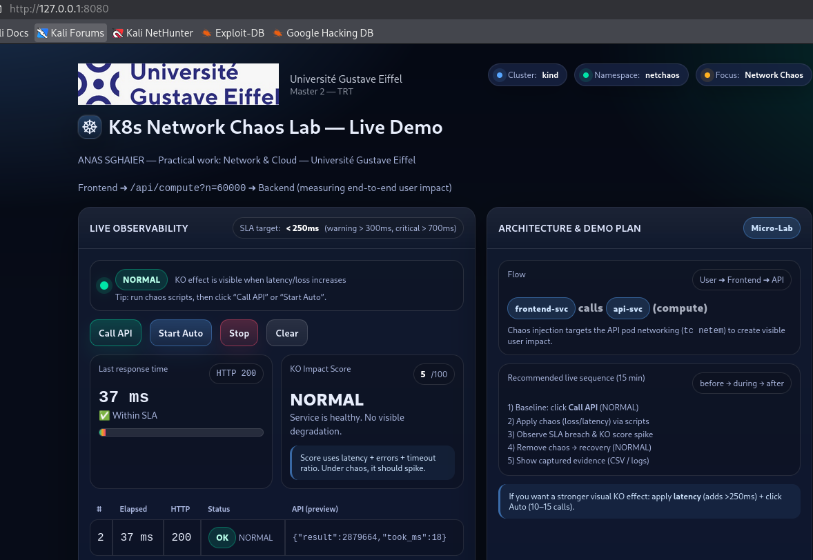

```md
# Kubernetes Network Chaos Lab  
### Network Chaos Engineering & Observability on Kubernetes

---

## 👤 Author
**Anas Sghaier**  
Master 2 – Technologies et Réseaux des Télécommunications (TRT)  
Université Gustave Eiffel  

---

## 🎯 Project Overview
Developed as part of the “Network & Cloud” practical coursework (M2 TRT).
This project is a **Network & Cloud practical lab** dedicated to **network-level chaos engineering in Kubernetes**.

A microservices application is deployed on a local Kubernetes cluster.  
**Controlled network latency** is then injected to evaluate:

- application performance degradation,
- SLA violations,
- system resilience and recovery **without redeployment**.

The application code remains **unchanged** during all experiments.  
All steps are **automated, reproducible and observable**.

---

## 🧱 Architecture Overview

```

User (Browser)
|
Port-forward
|
Frontend (Nginx)
|
Backend API (Python)
|
Network Chaos (tc netem on API Pod)

```

**Key points**
- Chaos is injected **only at the network layer**
- No modification of application source code
- Kubernetes ensures orchestration and recovery

---

## 🛠 Technologies Used

| Category | Tools |
|-------|------|
| OS | Kali Linux |
| Containers | Docker |
| Orchestration | Kubernetes (kind) |
| Networking | tc, netem |
| Backend | Python |
| Frontend | Nginx |
| Automation | Bash |
| Observability | Web dashboard |
| Results | CSV |
| Version control | Git & GitHub |

---

## 📁 Repository Structure

K8s-Network-Chaos-Lab/
├── app/        # Frontend & API source code
├── k8s/        # Kubernetes manifests
├── scripts/    # Automation & chaos scripts
├── results/    # CSV measurements
└── README.md
````

---

## 🚀 Experiment Workflow

### Step 1 — Environment Cleanup (Recommended)

```bash
cd scripts
pkill -f "kubectl.*port-forward" 2>/dev/null || true
kind delete cluster --name netchaos 2>/dev/null || true
kind get clusters
````

Ensures a **clean and reproducible environment**.

---

### Step 2 — Kubernetes Cluster Creation

```bash
bash 02-create-kind-cluster.sh
```

Creates a local Kubernetes cluster named **netchaos** using `kind`.

---

### Step 3 — Application Deployment

```bash
bash 03-deploy.sh
kubectl -n netchaos get pods
kubectl -n netchaos get svc
```

Deploys:

* Frontend service (Nginx)
* Backend API service (Python)

---

### Step 4 — Frontend Access

```bash
kubectl -n netchaos port-forward svc/frontend-svc 8080:80
```

Open in browser:

```
http://127.0.0.1:8080
```

---

## 📊 Network Chaos Experiments

### Baseline — Normal Network Conditions

```bash
bash 10-measure.sh baseline
```

* Latency ≈ **30 ms**
* SLA respected
* CSV generated

  
  
This dashboard shows the system under normal network conditions before any chaos injection.
---

### Chaos — Network Latency Injection

```bash
bash 06-chaos-latency.sh add
bash 10-measure.sh latency
```

Injected parameters:

* Latency: **250 ms ± 50 ms**
* Tool: `tc netem`
* Target: API pod network interface

Observed effects:

* Significant response time increase
* SLA violation
* Degraded user experience

---

### Recovery — Chaos Removal

```bash
bash 06-chaos-latency.sh del
bash 10-measure.sh recovery
```

* No redeployment required
* Network conditions restored
* System stability preserved

---

## 📈 Results Summary

| Phase    | Average Latency | Status       |
| -------- | --------------- | ------------ |
| Baseline | ~30 ms          | Normal       |
| Chaos    | ~450–700 ms     | SLA Violated |
| Recovery | ~30–40 ms       | Normal       |

All measurements are exported as **CSV files** for offline analysis.

---

## ✅ Key Learning Outcomes

* Network conditions can significantly impact application performance
* Kubernetes services recover without redeployment
* Chaos Engineering is effective for resilience validation
* Observability is essential for performance analysis

---

## 🧹 Cleanup

```bash
bash 99-cleanup.sh
```

Removes the cluster and cleans the environment.

---

## 🧠 Conclusion

This project demonstrates how **network-level chaos in Kubernetes** directly affects application performance and user experience.

By combining **Docker, Kubernetes, Linux networking tools and Chaos Engineering**, this lab provides a realistic and reproducible framework for **Network & Cloud experimentation and resilience analysis**.
