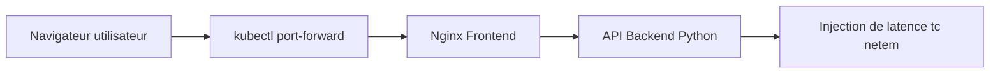
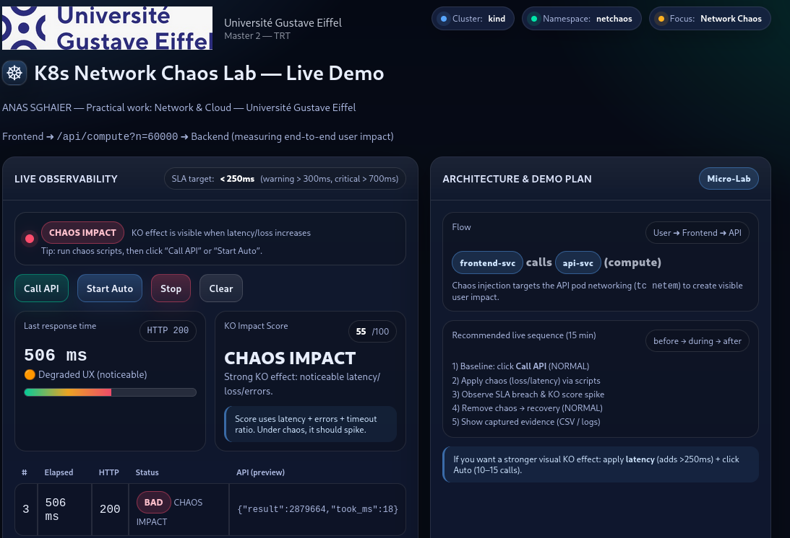
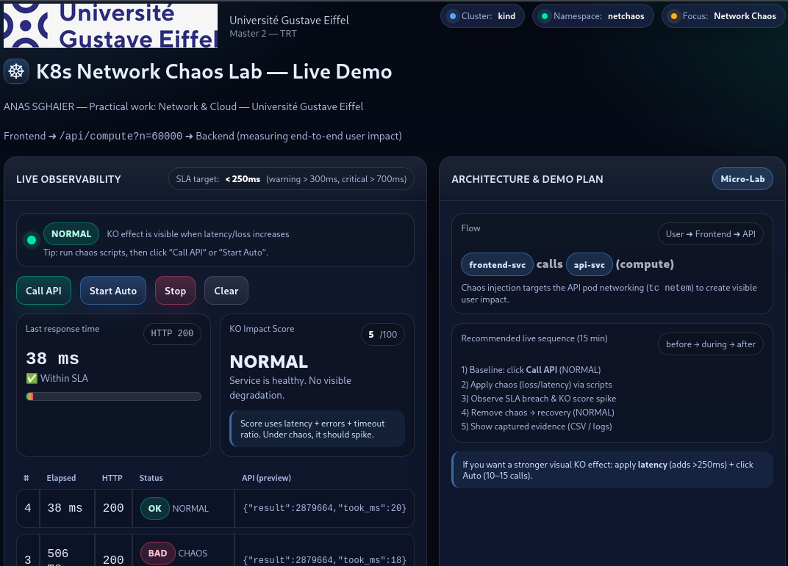
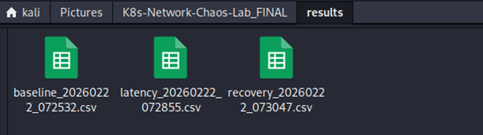

# Kubernetes Network Chaos Lab

[](https://kind.sigs.k8s.io/)
[](https://www.docker.com/)
[](https://www.python.org/)
[](https://www.kernel.org/)

Laboratoire d'expérimentation de **Chaos Engineering réseau sur Kubernetes** démontrant l'impact de la latence réseau sur les performances d'une architecture microservices.

---

## Auteur

Anas Sghaier  
Master 2 – Technologies et Réseaux des Télécommunications (TRT)  
Université Gustave Eiffel

---

## Présentation du projet

Ce projet a été réalisé dans le cadre du module **Network & Cloud** du Master 2 TRT.

L'objectif est d'étudier **l'impact des perturbations réseau sur une architecture microservices déployée sur Kubernetes** en utilisant des techniques de **Chaos Engineering**.

L'architecture déployée comprend :

- un **frontend Nginx**
- une **API backend développée en Python**

Ces services sont exécutés sur un **cluster Kubernetes local créé avec kind**.

Une latence réseau artificielle est ensuite injectée à l'aide de l'outil Linux **tc netem** afin d'observer :

- la dégradation des performances applicatives
- les violations de SLA
- la capacité de récupération du système **sans redéploiement des services**

Les expériences sont **automatisées, reproductibles et observables via un tableau de bord web**.

---

## Architecture

Le laboratoire reproduit une architecture microservices simple dans laquelle une perturbation réseau est injectée au niveau du backend.



Principes importants :

- Le chaos est injecté **uniquement au niveau réseau**
- Le code applicatif **reste inchangé**
- Kubernetes assure l'orchestration et la stabilité des services

---

## Technologies utilisées

| Catégorie | Outils |
|--------|------|
| Système | Kali Linux |
| Conteneurs | Docker |
| Orchestration | Kubernetes (kind) |
| Réseau | tc, netem |
| Backend | Python |
| Frontend | Nginx |
| Automatisation | Bash |
| Observabilité | Tableau de bord Web |
| Résultats | Fichiers CSV |
| Versioning | Git & GitHub |

---

## Structure du dépôt

```
K8s-Network-Chaos-Lab
│
├── app
│   ├── frontend
│   └── api
│
├── k8s
│   ├── deployments
│   └── services
│
├── scripts
│   ├── 02-create-kind-cluster.sh
│   ├── 03-deploy.sh
│   ├── 06-chaos-latency.sh
│   ├── 10-measure.sh
│   └── 99-cleanup.sh
│
├── results
│   └── *.csv
│
└── README.md
```

---

## Déroulement des expérimentations

### Nettoyage de l'environnement

```bash
cd K8s-Network-Chaos-Lab_FINAL/scripts

pkill -f "kubectl.*port-forward" 2>/dev/null || true
kind delete cluster --name netchaos 2>/dev/null || true
kind get clusters
```

Cette étape garantit un environnement propre et reproductible.

---

### Création du cluster Kubernetes

```bash
bash 02-create-kind-cluster.sh
```

Création d'un cluster Kubernetes local nommé :

```
netchaos
```

---

### Déploiement de l'application

```bash
bash 03-deploy.sh
kubectl -n netchaos get pods -o wide
kubectl -n netchaos get svc
```

Cette étape vérifie que les services et pods sont correctement déployés.

---

### Détection du port réel du frontend

```bash
kubectl -n netchaos exec deploy/frontend -- sh -c 'wget -qO- http://127.0.0.1:80/ >/dev/null && echo "FRONT OK sur 80" || echo "PAS sur 80"'
```

```bash
kubectl -n netchaos exec deploy/frontend -- sh -c 'wget -qO- http://127.0.0.1:8080/ >/dev/null && echo "FRONT OK sur 8080" || echo "PAS sur 8080"'
```

---

### Correction dynamique du service Kubernetes

Si le frontend utilise le port 80 :

```bash
kubectl -n netchaos patch svc frontend-svc --type='json' -p='[
 {"op":"replace","path":"/spec/ports/0/port","value":80},
 {"op":"replace","path":"/spec/ports/0/targetPort","value":80}
]'
```

---

### Accès à l'application

```bash
kubectl -n netchaos port-forward svc/frontend-svc 8080:80
```

Accès via :

http://127.0.0.1:8080

---

## Expériences de Chaos Engineering

### Baseline — Conditions normales

```bash
bash 10-measure.sh baseline
```


<sub><b>Figure —</b> Tableau de bord en conditions réseau normales (baseline).  
Le temps de réponse moyen est d’environ 37 ms, respectant l’objectif de SLA (&lt;250 ms).</sub>
---

### Chaos réseau — Injection de latence

```bash
bash 06-chaos-latency.sh add
bash 10-measure.sh latency
```



---

### Recovery — Suppression du chaos

```bash
bash 06-chaos-latency.sh del
bash 10-measure.sh recovery
```



---

## Résultats obtenus

| Phase | Latence moyenne | Statut |
|------|----------------|--------|
| Baseline | ~30 ms | Normal |
| Chaos | ~450–700 ms | SLA Violé |
| Recovery | ~30–40 ms | Normal |

Les mesures sont exportées sous forme de **fichiers CSV** pour analyse.



---

## Compétences démontrées

Ce projet met en évidence les compétences techniques suivantes :

- Déploiement d'un cluster Kubernetes local avec **kind**
- Déploiement d'une architecture **microservices conteneurisée**
- Manipulation des **services et pods Kubernetes**
- Expérimentation réseau avec **tc netem**
- Mise en œuvre de **Chaos Engineering**
- Analyse des performances applicatives
- Automatisation d'expériences avec **scripts Bash**
- Diagnostic réseau dans un environnement Kubernetes
- Utilisation de **Docker et Kubernetes pour des tests de résilience**
- Collecte et analyse de métriques sous forme de **fichiers CSV**

---

## Nettoyage de l'environnement

```bash
bash 99-cleanup.sh
```

Supprime le cluster Kubernetes et nettoie l'environnement local.

---

## Conclusion

Ce laboratoire démontre comment **les perturbations réseau dans Kubernetes influencent directement les performances d'une architecture microservices**.

En combinant Kubernetes, Docker, les outils réseau Linux et les principes du Chaos Engineering, ce projet fournit un cadre reproductible pour étudier **la résilience des systèmes distribués dans un environnement cloud**.
