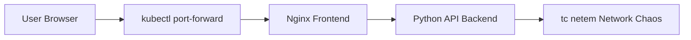

# Kubernetes Network Chaos Lab

[](https://kind.sigs.k8s.io/)
[](https://www.docker.com/)
[](https://www.python.org/)
[](https://www.kernel.org/)
[]()

Network Chaos Engineering and Observability Lab on Kubernetes

---

## Author

Anas Sghaier  
Master 2 – Technologies et Réseaux des Télécommunications (TRT)  
Université Gustave Eiffel

---

## Project Overview

This project was developed as part of the **Network & Cloud laboratory (Master 2 TRT)**.

The objective is to study the **impact of network perturbations on microservices deployed on Kubernetes** using **Chaos Engineering techniques**.

A microservice architecture composed of:

- a frontend (Nginx)
- a backend API (Python)

is deployed on a local Kubernetes cluster created with **kind**.

Controlled network latency is injected using **tc netem** in order to evaluate:

- application performance degradation
- SLA violations
- system resilience and recovery without redeployment

All experiments are automated, reproducible and observable through a monitoring dashboard.

---

## Architecture



---

## Technologies

| Category | Tools |
|--------|------|
| OS | Kali Linux |
| Containers | Docker |
| Orchestration | Kubernetes (kind) |
| Networking | tc, netem |
| Backend | Python |
| Frontend | Nginx |
| Automation | Bash |
| Observability | Web dashboard |
| Results | CSV |
| Version Control | Git & GitHub |

---

## Repository Structure

```
K8s-Network-Chaos-Lab
│
├── app
│   ├── frontend
│   └── api
│
├── k8s
│   ├── deployments
│   └── services
│
├── scripts
│   ├── 02-create-kind-cluster.sh
│   ├── 03-deploy.sh
│   ├── 06-chaos-latency.sh
│   ├── 10-measure.sh
│   └── 99-cleanup.sh
│
├── results
│   └── *.csv
│
└── README.md
```

---

## Experiment Workflow

### Environment cleanup

```bash
cd ~/Pictures/K8s-Network-Chaos-Lab_FINAL/scripts

pkill -f "kubectl.*port-forward" 2>/dev/null || true
kind delete cluster --name netchaos 2>/dev/null || true
kind get clusters
```

---

### Cluster creation

```bash
bash 02-create-kind-cluster.sh
```

---

### Deployment

```bash
bash 03-deploy.sh
kubectl -n netchaos get pods -o wide
kubectl -n netchaos get svc
```

---

### Detect frontend port

```bash
kubectl -n netchaos exec deploy/frontend -- sh -c 'wget -qO- http://127.0.0.1:80/ >/dev/null && echo "FRONT OK sur 80" || echo "PAS sur 80"'
```

```bash
kubectl -n netchaos exec deploy/frontend -- sh -c 'wget -qO- http://127.0.0.1:8080/ >/dev/null && echo "FRONT OK sur 8080" || echo "PAS sur 8080"'
```

---

### Fix service

```bash
kubectl -n netchaos patch svc frontend-svc --type='json' -p='[
 {"op":"replace","path":"/spec/ports/0/port","value":80},
 {"op":"replace","path":"/spec/ports/0/targetPort","value":80}
]'
```

---

### Access application

```bash
kubectl -n netchaos port-forward svc/frontend-svc 8080:80
```

Open:

http://127.0.0.1:8080

---

## Chaos Experiments

### Baseline

```bash
bash 10-measure.sh baseline
```


---

### Network Chaos

```bash
bash 06-chaos-latency.sh add
bash 10-measure.sh latency
```


---

### Recovery

```bash
bash 06-chaos-latency.sh del
bash 10-measure.sh recovery
```


---

## Results

| Phase | Latency | Status |
|------|--------|--------|
| Baseline | ~30 ms | Normal |
| Chaos | ~450–700 ms | SLA Violated |
| Recovery | ~30–40 ms | Normal |


---

## Cleanup

```bash
bash 99-cleanup.sh
```

---

## Conclusion

This project demonstrates how network perturbations injected in Kubernetes directly impact application performance and user experience.

It provides a reproducible framework for experimentation with **Cloud networking, microservices resilience and chaos engineering**.
